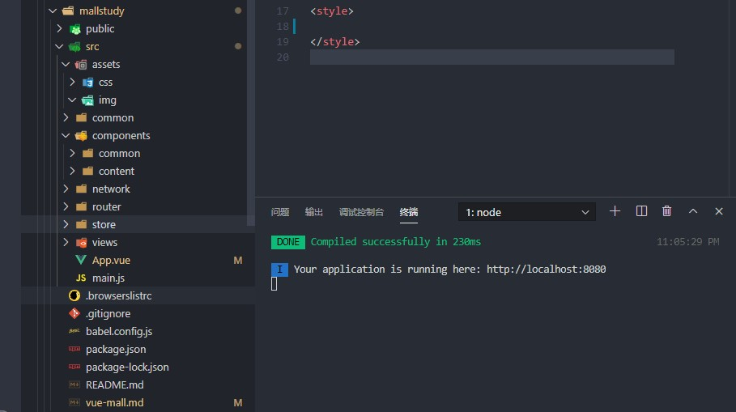
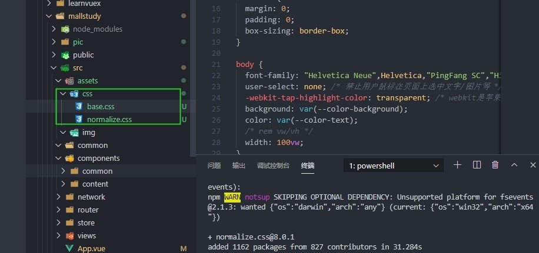

# vue-mall学习笔记

## 01---项目开发-github托管项目

- 推送远程仓库的两种方式
- 方式一
  - 登录github官网，创建一个空仓库；
  - 通过git clone将仓库克隆到本地；
  - vue-cli3生成的项目通过git命令提交到远程仓库；
    - git add .
    - git commit -m ‘说明’;
    - git push

- 方式二：(推荐)
  - 登录github官网，创建一个空仓库；
  - vue-cli3生成项目；
  - 通过两个git命令将项目推送到远程仓库；
    - git remote add origin https://github.com/yongshenstrong/name.git;
    - git push -u origin master;

## 02---项目开发-划分目录结构

- 划分目录结构

- assets（资源）：img  css

- components:   放公共组件分为两类：

  - common----该文件夹放入的内容可以被移植到别的项目中使用；
  - content----该文件夹放入的内容放入和当前项目相关的组件，不易适用于别的项目使用；

  分的比较细；

- views:   放入独立的视图组件,比如下面的举例；
  - home
  - category
- router:   用来放入路由文件；
- store：   用例放入状态管理文件；
- network： 用于放入网络封装的文件；
- common： 用于放入公共的js文件；



## 03---项目开发-css文件的引入

- 引入normalize.css文件，可以在github上搜索clone下来，并引入；
- :root是获取根元素（html）的一种方式



## 04---项目开发-vue.config和editorconfig

- 文件配置

```javascript

module.exports = {
  configureWebpack: {
    resolve: {
      alias: {
        //默认别名
          '@': 'src'
      }
    }
  }
}
```

```javascript
module.exports = {
  configureWebpack: {
    resolve: {
      alias: {
        'assets': '@/assets',
        'common': '@/common',
        'components': '@/components',
        'network': '@/network'
      }
    }
  }
}
```

